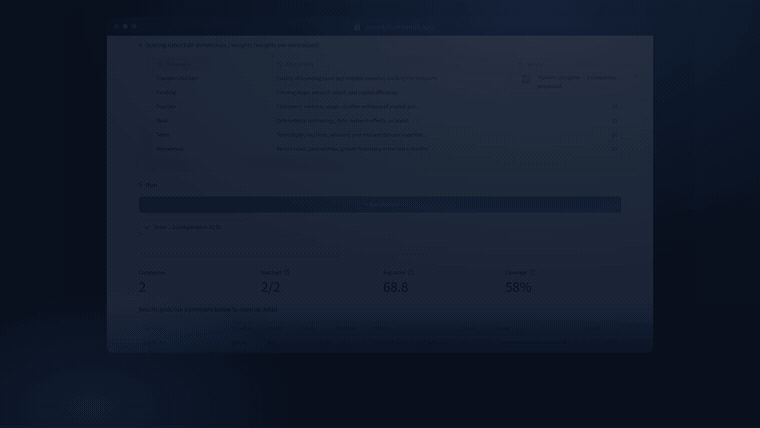
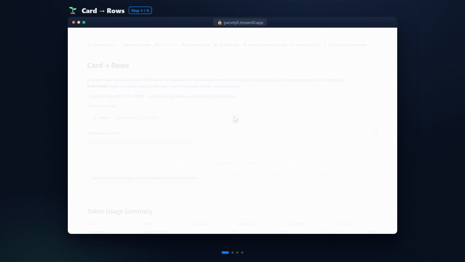
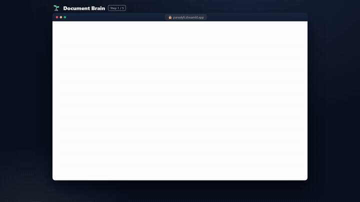
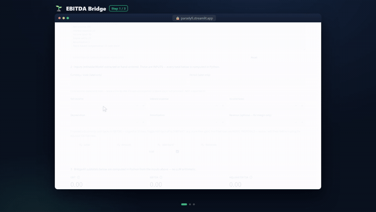
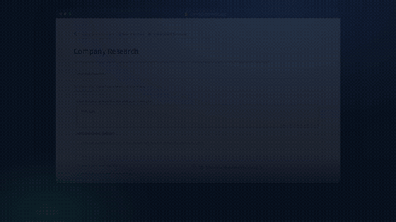
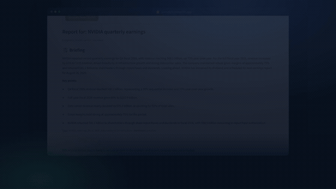
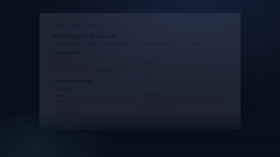

<div align="center">

# 🌱 ParselyFi

### Source-backed financial research, in one Streamlit app.

**List intelligence (match → enrich → classify → score) · interactive relationship graphs · company deep-dives · News & YouTube briefings · audio transcription** — powered by LinkUp `sourcedAnswer`, Google **Gemini 3.5 Flash**, and ElevenLabs.

[](https://parselyfi.streamlit.app)
[](https://www.python.org/)


<a href="assets/parselyfi-demo.mp4">
  
</a>

<sub>▶︎ Click for the full demo video · feature-by-feature walkthrough</sub>

</div>

---

## What is ParselyFi?

ParselyFi is a Streamlit workspace for **venture-capital, middle-market, and public-company research**. Its centerpiece turns a raw **list of companies** into a matched, enriched, classified, and **evidence-scored** comparison table — then maps the corporate relationships between them. It also turns a single company name, a news topic, or an audio file into **cited, source-backed output** — never fabricated. Every number traces back to a real retrieved source.

> **Design rule everywhere:** if a key, source, or result is missing, the app says so and degrades gracefully. It never invents companies, sources, transcripts, or summaries.

---

## ✨ Features

A source-backed research workspace — led by the **List Intelligence** pipeline and an **interactive relationship graph**, plus **image→rows extraction**, a **document-brain** (grounded RAG over your own files), and a deterministic **Adjusted-EBITDA bridge**, alongside company deep-dives, news/video briefings, transcription, a file manager, and a public data dashboard.

> 🛠️ **The animated previews below are full feature walkthroughs** — empty state → the cursor gliding to each click (with a ripple) → the loading state → the result, with a **zoom‑to‑focus camera**, step captions, and a progress bar, so you see *exactly* what was clicked and what happened (not a final‑state hero shot). Made via my reusable **[`feature-walkthrough-gif`](https://github.com/HomenShum/feature-walkthrough-gif)** skill — Playwright capture → Remotion render → ffmpeg, with research‑backed design (two‑pass palette, Arcade‑style zoom/pan, caption pacing). Also bundled here at [`.claude/skills/feature-walkthrough-gif/`](.claude/skills/feature-walkthrough-gif/SKILL.md).

### 📋 List Intelligence — the company-list pipeline

<p align="center"></p>

Paste or upload a list of companies → **Match** each to a canonical entity (High / Medium / No-Match, source-backed) → **Enrich** with structured fields → **Classify** against a sector definition you write → **Score** on a fully editable, weighted rubric where **every dimension cites a real source URL** → **Export** to CSV / Excel. Bounded concurrency, per-row evidence drill-down, KPI metrics, and an honest coverage / confidence readout. *This is the spine the product is built around: comparable, auditable company tables.*

### 🕸️ Relationship Graph

<p align="center"></p>

Map a company's corporate lineage — **parents, subsidiaries, acquisitions (with years), investors, partners, and competitors** — as an interactive, draggable network (pyvis). Seed it from a typed company or straight from your last List Intelligence run. Every edge is grounded; evidence links are filtered to **real retrieved sources only**, and uncited edges are drawn dashed so the graph shows what's source-backed.

### 🖼️ Card → Rows

<p align="center"></p>

Drop **images** — pitch-deck slides, cap tables, CRM/contact cards, screenshots of a portfolio list — and Gemini multimodal extraction turns them into **structured company rows** in an editable grid. One click **sends the companies straight into List Intelligence** to match/enrich/classify/score them. Never invents a company that isn't visible in the image.

### 📚 Document Brain

<p align="center"></p>

Upload your own files (**PDF / DOCX / TXT / MD / CSV / XLSX**) and ask questions. **Hybrid retrieval** (dense embeddings in an in-memory vector store + lexical TF-IDF, fused with Reciprocal Rank Fusion) grounds every answer in your documents with inline **`(filename#chunkN)` citations** — and says *"I could not find this in your documents"* rather than guessing. Spreadsheets become **queryable tables**. Degrades honestly to lexical-only search when the embedding stack isn't present.

### 💵 EBITDA Bridge

<p align="center"></p>

Paste an income statement (or enter figures by hand) and get an **auditable Adjusted-EBITDA reconciliation**: NI → EBIT → EBITDA → Adjusted EBITDA. The defining rule — **the LLM only proposes line items and add-backs; a pure Python function does every calculation** (in `Decimal`), so no total is ever hallucinated. Editable figures + adjustments recompute live; rendered as a KPI row, a step ladder, a **waterfall**, and an **auditable DAG** of the computation. Works with **no API key** — the math is pure Python.

### 🔍 Company Search & Analysis

<p align="center"></p>

Source-backed company research with a **3-pass workflow** — entity resolution → structured profile → missing-field backfill. Free-text *or* spreadsheet upload, an editable Pending/Complete/Skip review grid, batch enrichment with concurrency, per-agent token/cost tracking, and exportable search history.

### 📰 News & YouTube

<p align="center"></p>

**News Alerts:** a topic → LinkUp source-backed search → a cited Gemini briefing (summary, key points, sentiment) + an editable list of real sources. **YouTube Daily Reports:** a video URL / pasted transcript → a structured key-insight summary.

### 🎙️ Transcription & Summaries

<p align="center"></p>

Upload audio → **ElevenLabs** speech-to-text → a synced AnyWidget player that highlights the transcript during playback → one-click **AI summary** (summary + key points + action items). Paste/upload an existing transcript if you have no audio key.

### Plus

| Tab | What it does |
| --- | --- |
| 🗂️ **File Manager** | Browse, upload, download, and organize files in S3-compatible **Supabase Storage**, with pagination and folder navigation. |
| 🤖 **Parsely AI Assistant** | Chat assistant for workflow help and Q&A. |
| 📊 **Public Dashboard** | Curated financial data (companies, YouTube transcriptions, news, forums) with interactive tables — Master DB, Products, Partnerships, Investors. |

> The full ~40s reel above (hero) stitches these three workflows end-to-end with narration.

---

## 🏗️ Architecture

```
streamlit_app.py            # entry point (sidebar + 10 tabs + auth)
features/
  common.py                 # shared core: secret guard, lazy Gemini/LinkUp clients,
                            #   async runner, bounded token ledger, hardened web scraper
  ui.py                     # shared design system (theme CSS, hero, KPIs, tier badges)
  list_intelligence.py      # render_list_intelligence_tab() — match→enrich→classify→score→export
  relationship_graph.py     # render_relationship_graph_tab() — pyvis corporate-lineage graph
  multimodal_extract.py     # render_multimodal_extract_tab() — image → company rows → List Intel
  rag.py                    # render_rag_tab()                — Document Brain (hybrid RAG + table Q&A)
  financials.py             # render_financials_tab()         — Adjusted-EBITDA bridge (Python-computed)
  company_research.py       # render_company_research_tab()  — 3-pass LinkUp + Gemini
  news_youtube.py           # render_news_youtube_tab()      — LinkUp-backed news + video
  transcription.py          # render_transcription_tab()     — ElevenLabs STT + Gemini summary
tests/eval/                 # runnable research-agent eval harness (fast/slow, scored, --dry)
dev_preview_tabs.py         # no-auth dev/QA harness that renders the feature tabs directly
demo/                       # TestReel + Playwright recording scripts + Remotion video project
assets/                     # rendered demo video + preview GIFs
legacy/                     # archived prototypes & versioned experiments (see legacy/README.md)
```

**Reliability built into `common.py`** (it amplifies across agent loops, so it's enforced):

- **SSRF guard** — every fetch validates the URL and re-checks redirects per-hop; a connect-time DNS resolver blocks private/loopback/link-local/metadata IPs (DNS-rebind safe).
- **Bounded memory** — token ledger, scraper cache, and search history all have hard caps with eviction.
- **Timeouts + bounded reads** on every LLM / network / scrape call.
- **Honest status** — failed calls return empty results and surface an actionable banner (e.g. "rotate your Gemini key"), never fabricated data.

**Stack:** Streamlit 1.58 · Supabase (Postgres + S3 Storage) · `google-genai` (Gemini 3.5 Flash, incl. multimodal image input) · `linkup-sdk` · `pyvis`/`networkx` (relationship graph) · `PyMuPDF`/`python-docx` (ingest) · `fastembed`/`Qdrant` + `scikit-learn` (hybrid RAG) · `plotly`/`pyvis` (EBITDA waterfall + DAG) · `trafilatura`/BeautifulSoup (ethical scraping) · ElevenLabs + `streamlit-anywidget` · pandas.

---

## 🚀 Quickstart

```bash
# 1. Clone
git clone https://github.com/HomenShum/Parselyfi.git
cd Parselyfi

# 2. Install (use a virtualenv)
python -m venv .venv && source .venv/bin/activate   # Windows: .venv\Scripts\activate
pip install -r requirements.txt

# 3. Configure secrets (see below), then run
streamlit run streamlit_app.py
```

> The Streamlit Community Cloud entry point is **`streamlit_app.py`**.

### 🔑 Secrets

Create `.streamlit/secrets.toml` (gitignored). Storage/auth go under `[supabase]`; **API keys are top-level**:

```toml
[supabase]
SUPABASE_URL = "..."
SUPABASE_KEY = "..."
SUPABASE_S3_BUCKET_NAME = "..."
SUPABASE_S3_ENDPOINT_URL = "..."
SUPABASE_S3_BUCKET_REGION = "..."
SUPABASE_S3_BUCKET_ACCESS_KEY = "..."
SUPABASE_S3_BUCKET_SECRET_KEY = "..."

# Feature API keys (top level)
GEMINI_API_KEY      = "..."   # or legacy GOOGLE_AI_STUDIO   — Company / News / summaries
LINKUP_API_KEY      = "..."   # https://www.linkup.so        — source-backed search
ELEVEN_LABS_API_KEY = "..."   # speech-to-text for Transcription
```

Each feature **degrades gracefully**: a missing key shows a notice instead of failing, and never fabricates results.

---

## 🧪 Dev / QA

`dev_preview_tabs.py` renders the feature tabs directly (no Google-login gate) for fast iteration and headless QA:

```bash
streamlit run dev_preview_tabs.py
```

A runnable research-agent eval harness lives in `tests/eval/` (deterministic checks + optional Gemini judge; fabricates no scores):

```bash
python tests/eval/run_eval.py --dry      # deterministic checks only, no API
python tests/eval/run_eval.py --fast     # fast cases, live (needs keys)
```

The demo video is produced from the harness — see [`demo/README.md`](demo/README.md).

---

## 🗂️ Legacy

Earlier prototypes, the versioned `prod_*` experiments, ingestion/Qdrant/social-profile spikes, and the original `reference_codes/` research scripts live in [`legacy/`](legacy/). They are kept for provenance and are **not** part of the running app.

---

## 🧬 Lineage & tribute

ParselyFi is where five earlier experiments converge. Each attacked the same loop — *turn messy, multi-source inputs into trustworthy, decision-ready finance research* — from a different angle, and each contributes one pillar:

| Project | Pillar | Signature idea |
| --- | --- | --- |
| **parsely_Jan25** | Correctness | Entity disambiguation (negative-example mining + weighted-conflict scoring + LLM verdict) and corporate-lineage edges |
| **FinFlow** *(NVIDIA GTC 2025)* | Freshness + delivery | Recency-filtered YouTube → native Gemini multimodal video analysis with `[MM:SS]` timestamps → ElevenLabs spoken briefing |
| **project1-governmentforms** | Rigor | Adjusted-EBITDA where **Python does the math**, with an auditable tool-call DAG |
| **associate_assistant_vhs** | Durability + privacy | Encrypted, session-scoped transcript persistence + editable diligence templates + DOCX export |
| **parsely_tool** | Grounding | Agentic hybrid RAG (Qdrant dense + BM25 sparse + Cohere rerank) over multi-format, OCR'd documents |

The full deep-dive and the phased convergence roadmap are in **[`docs/TRIBUTE.md`](docs/TRIBUTE.md)**.

---

## 👨‍💻 About the creator

**Homen Shum** — data-driven builder across AI/ML, data analytics, and workflow automation, with a startup-banking background (JPMC) and a technical co-founder track record.

- 🌐 [homenshum.com](https://homenshum.com/) · [LinkedIn](https://linkedin.com/in/homen-shum) · [GitHub](https://github.com/HomenShum)

## 📜 License

Homen Shum reserves all rights not expressly granted by the license. See [LICENSE](LICENSE).
